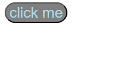

# Buttons `<button>`
- Uses button tags `<button></button>`
- Can be edited with CSS elements
    - ```
        <button style="font-size: 25px; background-color: grey; color:lightblue; border-radius: 25px;">click me</button>
        ``` 
        
- Button can have hyperlink
    - ex, `<a href="https://google/com">`
    - ex, `<a href="page2.html>` (takes to another html file)

- Additionally, button can execute javascript code
    ```
        <button onclick="doSomething()" style="font-size: 25px; background-color: grey; color:lightblue; border-radius: 25px;">click me</button>

        <p id="greeting">Hello</p>
        <script>
            function doSomething(){
                document.getElementById("greeting").innerHTML = "goodbye"
            }
        </script>
    ``` 

